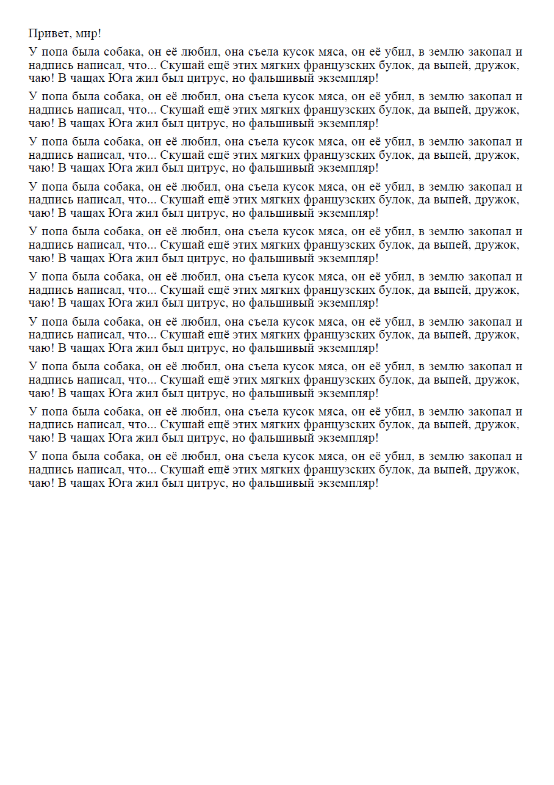

### Генерация PDF

Для генерации PDF на языке Go можно использовать популярный пакет gofpdf. Сам пакет прописан на GitHub: https://github.com/jung-kurt/gofpdf, а его документация — на godoc: https://godoc.org/github.com/jung-kurt/gofpdf. Самое сложное в нём — наделать кириллических шрифтов из TTF, всё остальное довольно просто. 🙂 Вот какую страницу я сгенерировал за пять минут (включая все разбирательства со шрифтами):



Шрифты подготавливаются с помощью команды makefont, входящей в состав пакета (я взял `times.ttf` из папки `Fonts` в Windows):

```
makefont.exe --embed --enc=../font/cp1251.map times.ttf
```
 
Мы получаем файлы `times.z` и `times.json`. Я переименовал их в `times_1251.z` и `times_1251.json` и положил рядом с исполняемым файлом программы. Также я скопировал файл `cp1251.map` из папки `font` пакета. Сама программа довольно очевидна:

```go
package main
 
import (
    "github.com/jung-kurt/gofpdf"
    "log"
)
 
func main() {
    pdf := gofpdf.New("P", "mm", "A4", "")
    pdf.AddFont("Times", "", "times_1251.json")
    pdf.AddPage()
    pdf.SetFont("Times", "", 14)
    tr := pdf.UnicodeTranslatorFromDescriptor("cp1251")
    pdf.MultiCell(0, 5, tr("Привет, мир!"), "", "", false)
    pdf.Ln(2)
    text := "У попа была собака, он её любил, она съела кусок мяса, " +
        "он её убил, в землю закопал и надпись написал, что... " +
        "Скушай ещё этих мягких французских булок, да выпей, дружок, чаю! " +
        "В чащах Юга жил был цитрус, но фальшивый экземпляр!"
    for i := 0; i < 10; i++ {
        pdf.MultiCell(0, 5, tr(text), "", "", false)
        pdf.Ln(2)
    }
    err := pdf.OutputFileAndClose("test.pdf")
    if err != nil {
        log.Fatal(err)
    }
}
```