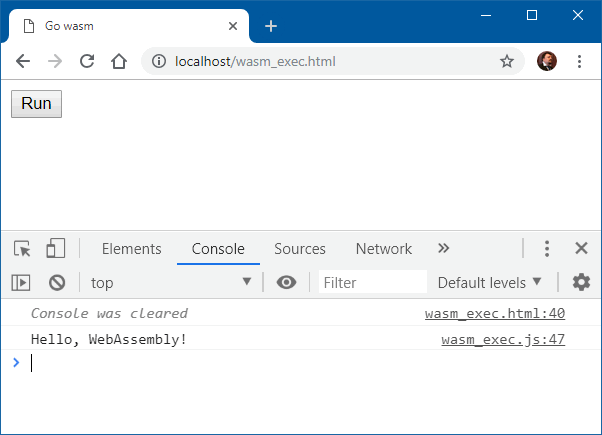

### Запуск программы Go как WebAssembly

Программу возьмём для начала простейшую (назовём её test.go)

```go
package main
 
import "fmt"
 
func main() {
    fmt.Println("Hello, WebAssembly!")
}
```

Компилируем её так:

```
SET GOOS=js
SET GOARCH=wasm
go build -o test.wasm test.go
```

Для запуска этого дела в браузере нам потребуется какой-нибудь веб-сервер. Я взял Open Server, благо он уже установлен на ноутбуке. Копируем наш test.wasm в папку веб-сайта, туда же копируем wasm_exec.html и wasm_exec.js из папки C:\Go\misc\wasm. Наконец, добавляем в .htaccess следующую строчку

```
AddType application/wasm .wasm
```

Всё готово. Запускаем веб сервер и вводим в строке адреса

```
http://localhost/wasm_exec.html
```

Появляется кнопка «Run», нажимаем её и видим в консоли JavaScript строчку «Hello, WebAssembly!»



Поздравляем себя: простейшее приложение мы сумели написать и запустить. Теперь дело за малым: освоить WebAssembly и научиться делать что-нибудь полезное. Примеры Go-программ для WebAssembly можно увидеть [здесь](https://github.com/johanbrandhorst/wasm-experiments).
